# RV32I-Pro: 5-Stage Pipelined RISC-V Processor

## 1. Project Title
**RV32I-Pro: A High-Performance 5-Stage Pipelined RISC-V Core with Advanced Hardware Hazard Resolution**

## 2. Project Description
This project is a cycle-accurate implementation of the **RISC-V (RV32I) Instruction Set Architecture** based on a 5-stage pipeline (Fetch, Decode, Execute, Memory, and Writeback). Developed in Verilog HDL and synthesized/simulated in Xilinx Vivado, this core represents a journey from a "raw" pipeline to a robust, hazard-aware processor. The design features a custom **Hazard Unit** capable of resolving Data Hazards (via Forwarding and Stalling) and Control Hazards (via Flushing) entirely in hardware, achieving an ideal CPI (Cycles Per Instruction) of 1.

## 3. Project Objective
* **Architectural Efficiency:** To transition from a single-cycle implementation to a 5-stage pipeline, significantly increasing instruction throughput.
* **Hardware Control Logic:** To implement "invisible" hardware handling for dependencies, eliminating the need for software compilers to insert manual NOPs.
* **Verification Depth:** To diagnose and resolve complex race conditions (Load-Use and Branch Mispredictions) using waveform analysis.

## 4. Technical Stack

**Language:** Verilog HDL  
**Target ISA:** RISC-V RV32I (Base Integer Instruction Set)  
**Toolchain:** Xilinx Vivado (for Synthesis and Behavioral Simulation)  
**Verification:** Testbench-driven simulation with waveform analysis to verify pipeline register transitions and stall logic.  

---

## Why This Project Matters

This implementation demonstrates a deep understanding of Computer Architecture and Digital Logic Design. It solves the "Data Hazard" problem, which is a fundamental challenge in CPU design, ensuring that even when instructions depend on one another, the processor calculates the correct result without manual software delays (NOPs).


## 5. Fundamentals: RISC-V and Pipelining
### RISC-V Overview
RISC-V is an open-standard ISA designed for scalability. Its fixed 32-bit instruction length and simplified decoding logic make it ideal for pipelined implementations, allowing for clean separation of datapath stages.

### The Pipeline Advantage
By breaking instruction execution into five stages—**IF (Fetch), ID (Decode), EX (Execute), MEM (Memory), WB (Writeback)**—the processor can overlap the execution of up to five instructions at once. This reduces the critical path length, allowing for higher clock frequencies compared to single-cycle designs.

## 6. Architecture Diagram
The architecture follows the standard 5-stage RISC-V datapath. It consists of five distinct processing stages separated by synchronous pipeline registers (IF/ID, ID/EX, EX/MEM, MEM/WB).

**Fetch:** Updates the Program Counter (PC) and retrieves instructions from memory.
**Decode:** Decodes instructions and reads operand values from the Register File.
**Execute:** Performs ALU arithmetic/logic operations and calculates branch targets.
**Memory:** Accesses Data Memory for Load/Store operations.
**Writeback:** Updates the Register File with the final results.

These registers synchronize the flow of data, allowing the processor to work on five different instructions simultaneously in a staggered manner. The diagram below illustrates this complete datapath, including the PC, Instruction Memory, Register File, ALU, Data Memory, and the main control path.

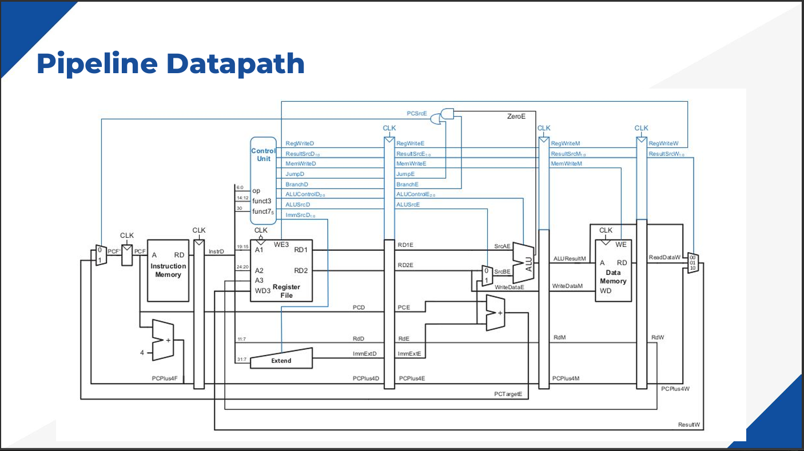

## 7. Initial Implementation: The "Raw" Pipeline
In the initial phase, the processor was designed without any hazard detection logic. While the data flow worked for independent instructions, it failed immediately when dependencies were introduced.

**The Test Case:**
```assembly
addi x1, x0, 4   # I1: Writes 4 to x1
add  x2, x1, x1  # I2: Reads x1 (Expected: 4)
sub  x3, x2, x1       # I3: uses fresh x2  (EX/MEM/WB -> EX forward)
and  x4, x2, x2       # I4: uses fresh x3  (EX/MEM/WB -> EX forward)
sw   x4, 0(x3)        # I5: store uses fresh x4 as rs2 (EX/MEM -> MEM forward)
lw   x5, 1(x3)        # I6: load‑use after store, check MEM/WB behavior + hazards
```
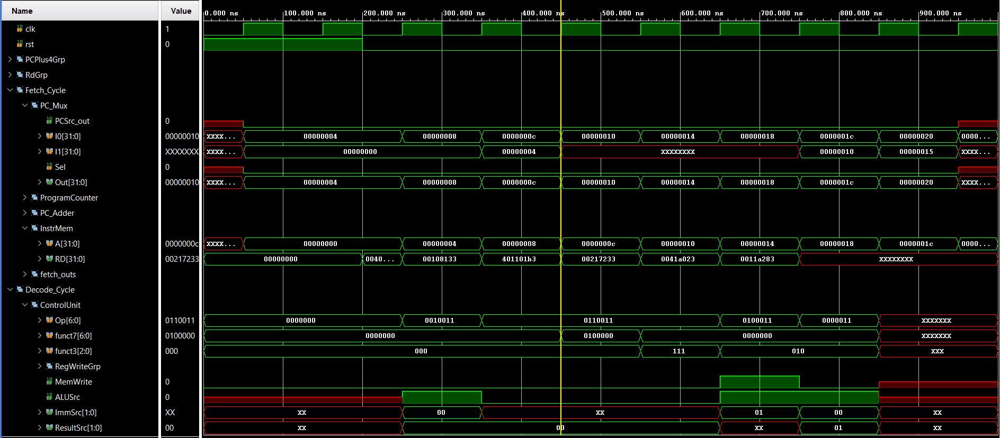
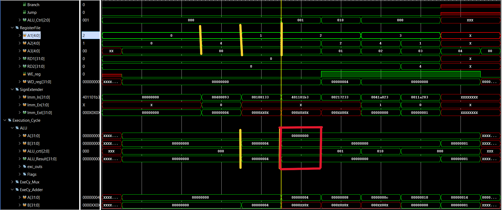
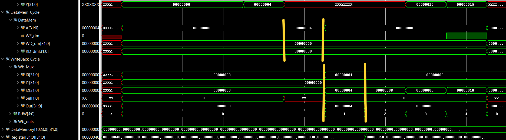

### The Failure:
In a raw pipeline, instruction I2 reaches the Decode stage while I1 is only in the Execute stage. Since I1 has not yet reached Writeback, I2 reads the stale/reset value of x1 (which was 0) from the Register File. This error propagated through the entire sequence, causing sub, and, and sw instructions to compute incorrect results.

### Observation:
The red highlights in the waveform show the ALU executing with 0x00 inputs instead of the expected 0x04.

## 8. Hazard Handling Strategy
To fix these failures, we categorized hazards into three types and implemented specific hardware solutions:
⦁	Data Hazards (ALU): Solved via Forwarding (Bypassing the Register File).
⦁	Load-Use Hazards (Memory): Solved via Stalling (Freezing the pipeline).
⦁	Control Hazards (Branch): Solved via Flushing (Injecting Bubbles).

## 9. Hazard Unit Implementation: Detailed Analysis

The Hazard Unit is a centralized combinatorial logic block responsible for maintaining the "Sequential Execution" illusion in a parallel 5-stage pipeline. It continuously monitors the Source Registers ($Rs1, Rs2$) of instructions in the early stages and compares them against the Destination Registers ($Rd$) of instructions in the later stages.

---

### A. Data Forwarding Logic (Solving ALU-ALU Hazards)

The most common hazard occurs when an instruction in the Execute (EX) stage needs a result that is currently in the Memory (MEM) or Writeback (WB) stage.

We implemented **"Forwarding Paths"** that allow the ALU to grab data directly from the pipeline registers of later stages, skipping the Register File read entirely.

### The Challenge:
If both the Memory Stage and Writeback Stage have data for the same register (e.g., `x1`), which one should the ALU use?


**MEM Hazard (Priority 1):**  
If the instruction in MEM is writing to a register (`RegWriteM == 1`), the destination is not `x0`, and it matches the source of the instruction in EX (`RdM == Rs1E`), we forward the result from the MEM stage.

**Logic:**  
`ForwardAE = 2'b10`

**WB Hazard (Priority 2):**  
If the MEM stage doesn't match, but the WB stage is writing to the required register (`RegWriteW == 1`) and it matches the source in EX (`RdW == Rs1E`), we forward from the WB stage.

**Logic:**  
`ForwardAE = 2'b01`

**Why the Priority?**  
If both MEM and WB stages are writing to the same register, the MEM stage contains the most recent version of that register according to the program order. Prioritizing MEM prevents using "stale" data from the WB stage.

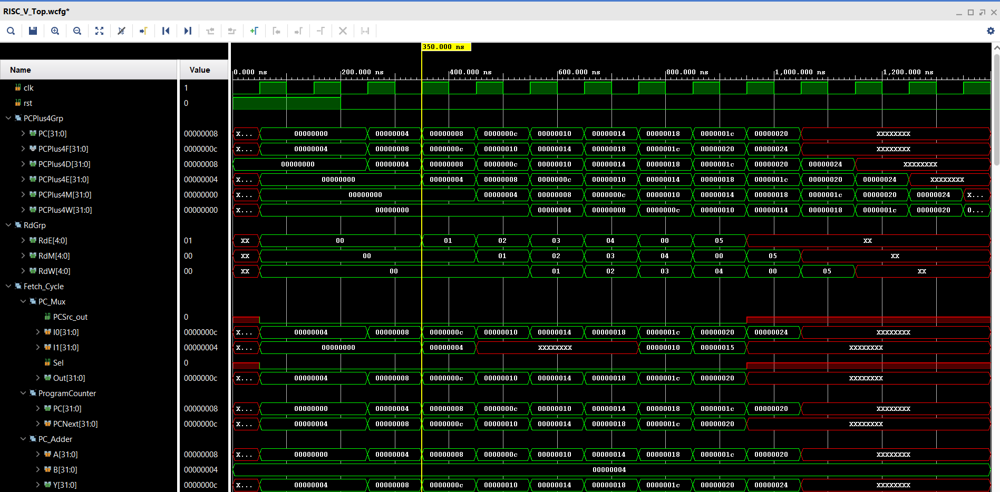
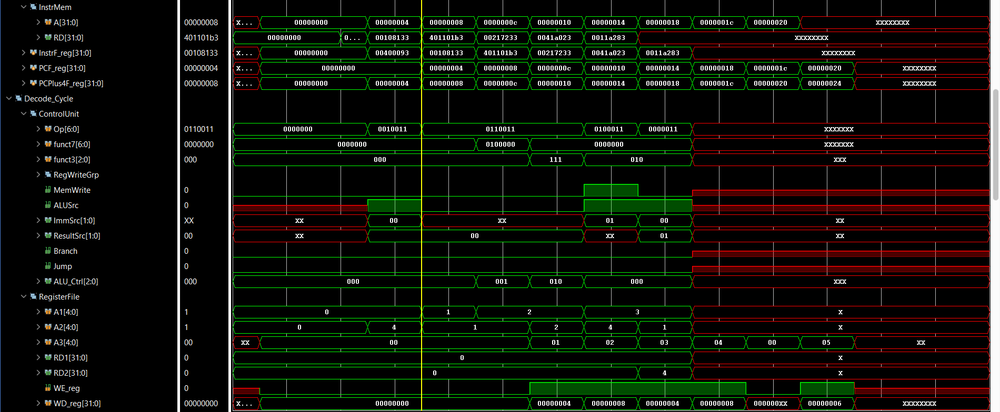
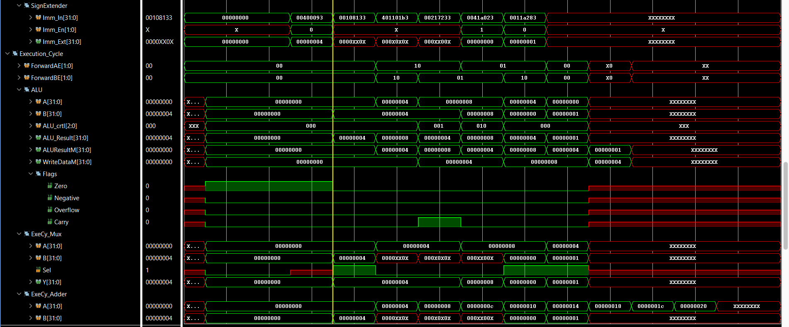

---

### B. Load-Use Stall Logic (Solving Memory-Data Hazards)

A `lw` (Load Word) instruction only produces data and read from Data Memory at the end of the MEM stage. Therefore, a very next instruction in the EX stage cannot receive this data via forwarding because the data literally does not exist yet when the ALU needs it.

**The Test Case:**
```assembly
lw  s7, 40(s5)
and s8, s7, t3
or  t2, s6, s7
sub s3, s7, s2
```

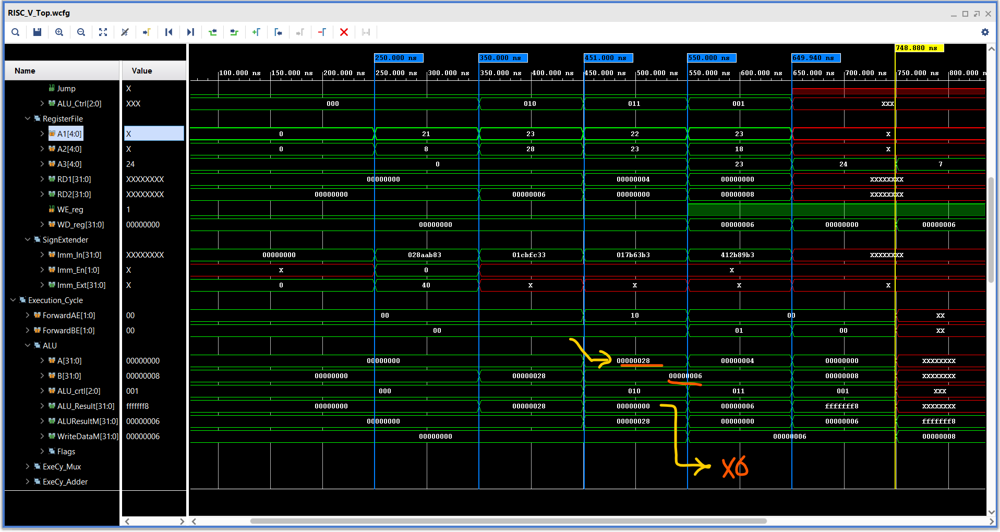

### The Symptom:
In our waveform, we observed `lw x7, 40(x5)` followed by `and x8, x7, x3`. The `and` instruction read the stale value `0x28` instead of the loaded value `0x06` because it couldn't wait.

**Detection:**  
We detect this if the instruction currently in Execute is a Load (`ResultSrcE[0] == 1`) and its destination (`RdE`) matches the sources of the instruction currently in Decode (`Rs1D` or `Rs2D`).

**Action (The 1-Cycle "Bubble"):**

- **StallF & StallD:**  
  We set these to 1. This disables the clock enable on the Program Counter and the IF/ID pipeline register. The processor "freezes" the Fetch and Decode stages.

- **FlushE:**  
  We set this to 1. This synchronously clears the ID/EX register, turning the dependent instruction's first attempt at execution into a NOP.

In the next clock cycle, the Load moves to the MEM stage, and the dependent instruction (still in Decode) moves to Execute, where it can now successfully receive the data via the MEM-to-EX forwarding path.

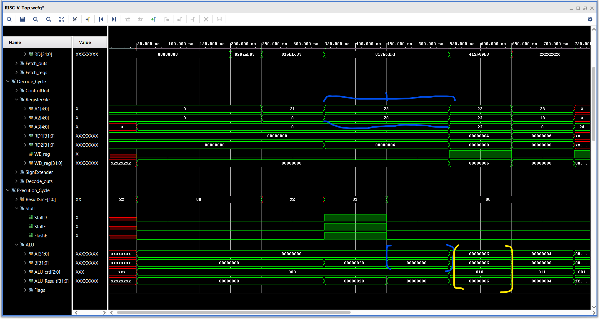

**Observation:** The waveform now shows the pipeline "pausing" for 1 cycle (PC holds value 104), creating a bubble that allows the memory read to complete.
---

### C. Control Hazard Logic (Solving Branch Mispredictions)

In our architecture, the branch decision (`PCSrcE`) is calculated in the Execute stage. By the time `PCSrcE` is asserted (Branch Taken), the pipeline has already speculatively fetched two instructions that should not be executed.

**The Test Case:**
```assembly
beq x9, x18, L1	
sub x24, x6, x19	
or  x25, x31, x21		
L1: add x23, x19, x20
    add x26, x25, x24
    add x27, x26, x25
```

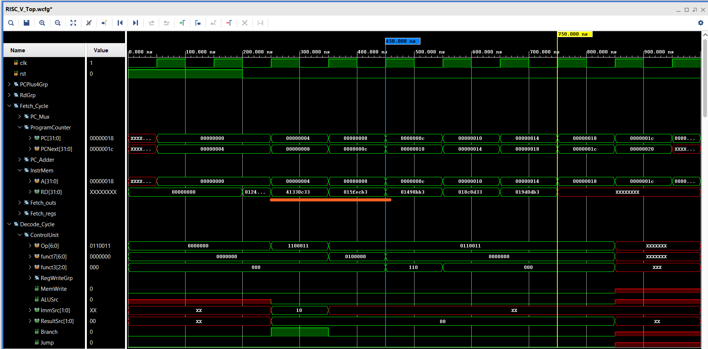
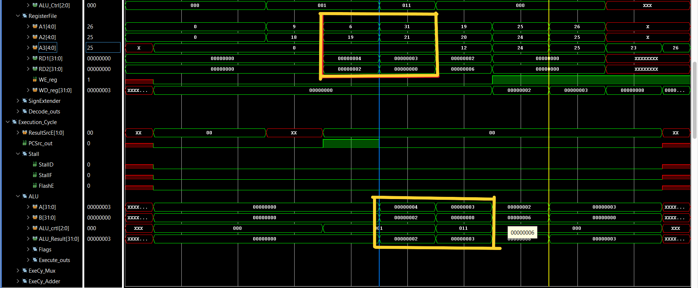
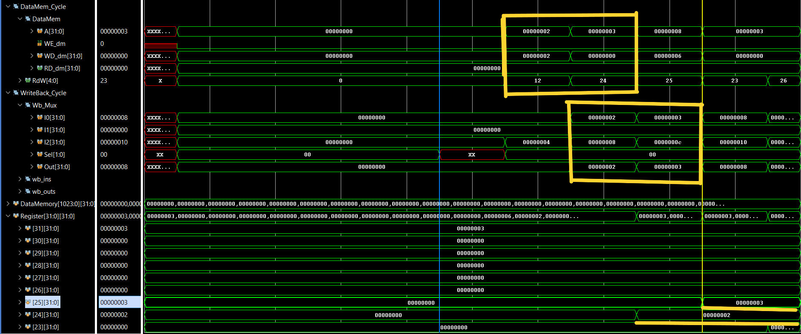

### The Symptom:
The instructions immediately following the branch (e.g., `add` and `sub`) were executing and modifying registers even though the program logic dictated they should be skipped.

**Action :**
We implemented a synchronous Pipeline Flush.

**The Logic:** When `PCSrcE` (Branch Taken signal) goes High:

1. **FlushD = 1:** Clears the IF/ID register (wiping the instruction in Decode).
2. **FlushE = 1:** Clears the ID/EX register (wiping the instruction in Execute).

**Design Note:**  
The Flush signals act as a synchronous reset, converting the "wrong" instructions into NOPs. This ensures the architectural state (registers/memory) remains clean.


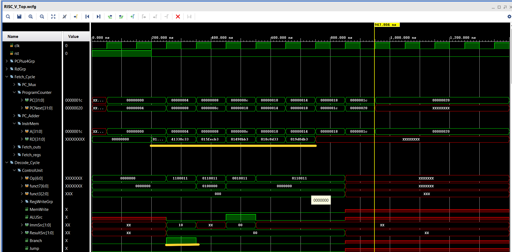
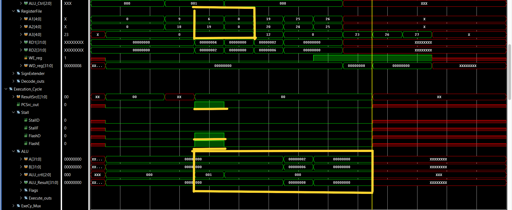
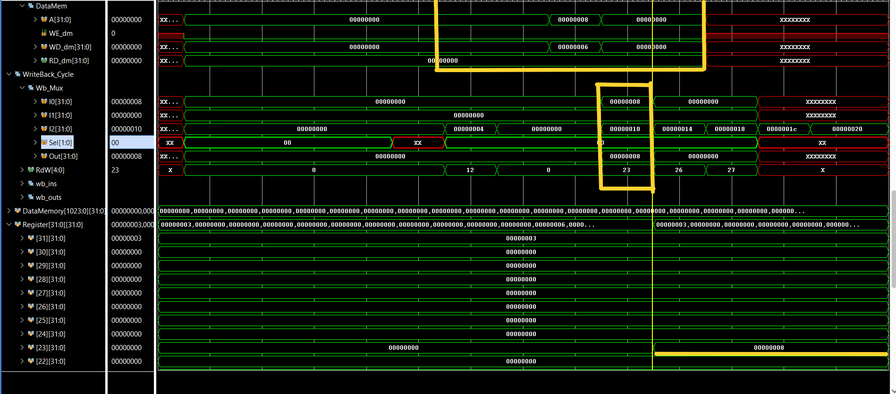

**Observation:**  
The waveforms show `PCSrc_out` going high, immediately triggering `FlushD` and `FlushE`. The instructions in the pipeline are replaced by NOPs (`00000013`).
---


### Summary of Control Signals:

| Signal | Logic Condition | Purpose |
| :--- | :--- | :--- |
| ForwardAE/BE | (RdM/W == RsE) & RegWriteM/W | Bypasses Register File to provide immediate ALU results. |
| StallF/D | lw_dependency | Holds the instruction stream to allow memory loads to complete. |
| FlushD | BranchTaken | Clears the Decode stage to prevent "wrong path" execution. |
| FlushE | lw_dependency OR BranchTaken | Clears the Execute stage to inject a NOP/Bubble. |

## 10. Integrated Hazard-Aware Architecture
The following diagram represents the final, fully resolved datapath. Unlike the basic pipeline, this architecture explicitly features the **Hazard Unit** integrated into the control path.

It visualizes the critical hardware additions:
* **Forwarding Paths:** Data lines routing back from the MEM and WB stages to the ALU inputs via 3-way multiplexers.
* **Control Lines:** The specific `Stall` and `Flush` signals connecting the Hazard Unit to the pipeline registers (IF/ID, ID/EX), demonstrating how the hardware physically pauses or clears stages during race conditions.

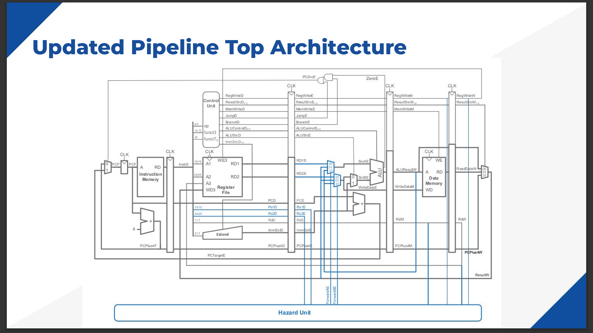

## 11. Final Verification: Comprehensive Test

The final design was stress-tested with a composite program containing all-type arithmetic, Load/Store memory operations, and conditional Branching.

**Verdict:**  
The processor handles all hazard types seamlessly. Data integrity is maintained across all stages.

[Finalwaveform](images/Final_wf1.png)
[Finalwaveform](images/Final_wf2.png)
[Finalwaveform](images/Final_wf3.png)
---

## 12. RTL Schematic & Implementation

To ensure design quality and proper hierarchy, the design was elaborated in Xilinx Vivado. The schematic below confirms the logical connections between the Datapath (Fetch, Decode, Execute, Mem, WB) and the centralized Control Units (Controller, Hazard Unit).

[Schematic diagram](images/Schematics.png)

**Author:** [VEERARAGAVAN M]  
**Tools:** Xilinx Vivado 2024, Verilog HDL  
**License:** MIT
